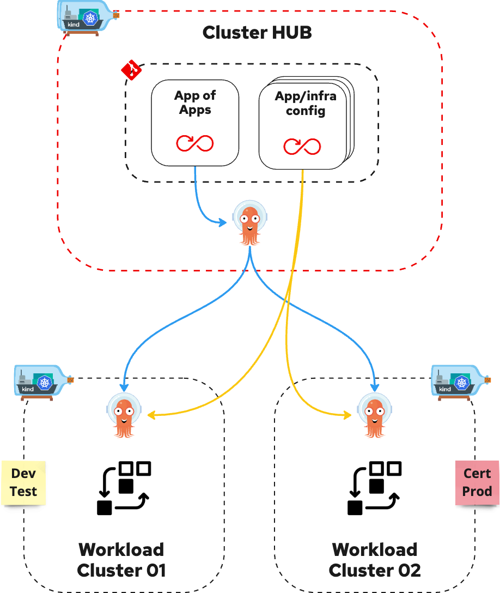
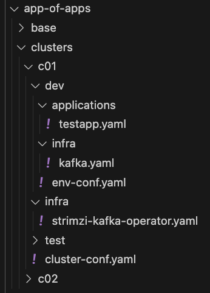

# GitOps with ArgoCD using an ApplicationSet App-Of-Apps approach

## Introduction
The aim of this repository is to show how it's possible to design a git "App-of-Apps" repository with some ArgoCD ApplicationSet to declare where our applications and infra services have to be in our clusters/environments and how to configure them using configuration values taken from both the the configuration repositories and the "App-of-Apps" repository.

## Requirements
We assume that you have the latest version of the kind binary, which you can get from the [Kind GitHub repository](https://github.com/kubernetes-sigs/kind/releases).

Kind requires a running Docker Daemon. There are different Docker options depending on your host platform (you can follow the instructions on the [Docker website](https://docs.docker.com/get-started/get-docker/)). You could also prefer to install podman as alternative to docker using the [podman installation instructions](https://podman.io/docs/installation).

You’ll also need the kubectl binary, which you can get by following the [kubectl installation instructions](https://kubernetes.io/docs/tasks/tools/install-kubectl/).

Once you have all the binaries installed, and a Docker daemon running, make sure everything works:

## Validate docker installation
```bash
docker ps
docker version
```

or

```bash
podman ps
podman version
```

## Validate kind
```bash
kind version
```

## Validate kubectl
```bash
kubectl version
```

I have used these versions for my lab:
```bash
$ podman version
Client:       Podman Engine
Version:      5.0.1
...
$ kind version
kind v0.26.0
...
$ kubectl version
Client Version: v1.30.0
...
```

## Configure podman machine if you are using it
Open a ssh session with the podman machine
```bash
podman machine ssh podman-machine-default
```
execute
```bash
sudo sysctl net.ipv4.ip_unprivileged_port_start=80
```
to permit use of ports >= 80 as unprivileged ports.
Then close the ssh session
```bash
exit
```

## Install and start cloud-provider-kind loadbalancer
In a terminal execute
```bash
go install sigs.k8s.io/cloud-provider-kind@latest
sudo cloud-provider-kind
```
this command will create a new container for each k8s service with type Loadbalancer giving it an external IP address for the extra cluster communication.

## Create the clusters and install everything
```bash
in another terminal execute
install.sh
```

The script above will create:
* three kind clusters (one cluster hub and two workload clusters) with port mapping configured to expose the ports 80 and 443 of the control-plane node of each cluster on some host ports;
* a ingress-nginx in every cluster to enable the exposition of cluster services;
* a git server Gitea in the cluster hub, but visible from the other clusters;
* some git repositories in the git server:
    * the App-of-Apps repository;
    * a couple of helm config repositories relative to sample application and infra services;
* an ArgoCD instance in the cluster hub, configured with the reference to the internal git server and enabled to use some eternal helm oci repository;
* an ArgoCD instance in each workload cluster using an ArgoCD Application applied in the cluster hub ArgoCD namespace;
* the sample applications and infra services (a Strimzi Kafka Operator and a Kafka instance) in the workload clusters/environments as defined in the App-Of-Apps repository tree applying the ArgoCD ApplicationSets included in the same repository.



Here an extract of the App-Of-Apps tree



In every leaf of the App-Of-Apps tree you can define (using a sample yaml file) everything which is needed to reference a git or helm repository and add its specific configurations overriding the default configuration defined in the same repository. There are also other config yaml files to add custom cluster and environment configurations (for example to customize the syncPolicy section of the ArgoCD Application resources).

## Test the demo applications deployed using the initial state of the App-of-Apps repository
You should have a couple of demo applications:
* in the cluster kind-01 for the dev and test environments
* in the cluster kind-02 for the cert and prod environments

```bash
curl "http://localhost:8080/dev/bar" ; echo
curl "http://localhost:8080/dev/foo" ; echo
curl "http://localhost:8080/test/bar" ; echo
curl "http://localhost:8080/test/foo" ; echo
curl -k "https://localhost:8443/dev/bar" ; echo
curl -k "https://localhost:8443/dev/foo" ; echo
curl -k "https://localhost:8443/test/bar" ; echo
curl -k "https://localhost:8443/test/foo" ; echo
curl "http://localhost:9080/cert/bar" ; echo
curl "http://localhost:9080/cert/foo" ; echo
curl "http://localhost:9080/prod/bar" ; echo
curl "http://localhost:9080/prod/foo" ; echo
curl -k "https://localhost:9443/cert/bar" ; echo
curl -k "https://localhost:9443/cert/foo" ; echo
curl -k "https://localhost:9443/prod/bar" ; echo
curl -k "https://localhost:9443/prod/foo" ; echo
```
you should obtain the name of the application in output (bar-app or foo-app)

## Set /etc/hosts of local host to view the UI portals of Gitea and ArgoCD instances
Edit /etc/hosts file
```bash
sudo vi /etc/hosts
```
adding this lines
```bash
127.0.0.1        gitea.nip.io argocd.nip.io argocd01.nip.io argocd02.nip.io
```
or execute this
```bash
sudo echo "127.0.0.1        gitea.nip.io argocd.nip.io argocd01.nip.io argocd02.nip.io" >> /etc/hosts
```
now you can open the links showed at the end of the 'install.sh' script execution.

Obviously, you can change the git repositories in 'gitea.nip.io' or create new git repositories linking them in the App-of-Apps repository tree.

:partying_face: Good luck with GitOps! :partying_face:

## Clean all

Destroy kind clusters:

```bash
kind delete clusters --all
```

## References

Projects
* [Kind](https://kind.sigs.k8s.io/)
* [Argocd](https://argo-cd.readthedocs.io/en/stable/)